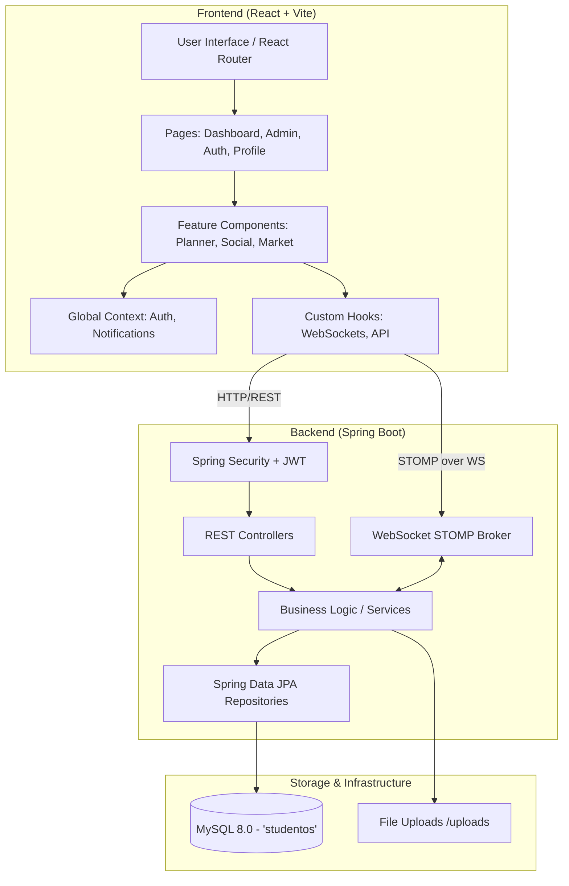
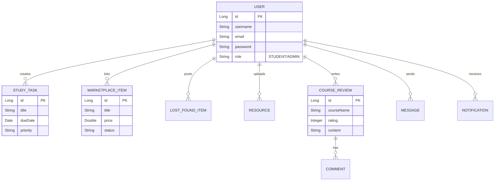

# StudentOS - Total Context Memory

This document serves as the **Total Context Memory** for the `StudentOS` project. It is designed to give you (the user) and AI agents a complete, high-level, and interconnected view of how the entire system operates, its architecture, and the detailed breakdown of its components.

## 🚀 Project Overview
**StudentOS** is a premium, all-in-one university management and productivity dashboard. It centralizes academic planning, campus resources, community commerce, and administrative oversight.

---

## 🏗️ High-Level Architecture

The project uses a decoupled Client-Server architecture.

---

## 🛠️ Technology Stack
### Frontend
*   **Framework**: React 18 (Vite)
*   **Styling**: Tailwind CSS (Dark-First, Glassmorphism UI)
*   **Animations**: Framer Motion
*   **Routing**: React Router 6
*   **State Management**: TanStack React Query (Server State) & Context API (Global State)
*   **Real-time**: SockJS + STOMP (WebSockets)

### Backend
*   **Framework**: Java 17 + Spring Boot 3.2.x
*   **Security**: Spring Security + JWT (Stateless sessions)
*   **ORM**: Spring Data JPA (Hibernate)
*   **Database**: MySQL 8.0
*   **Real-time**: Spring WebSocket STOMP
*   **Utilities**: Lombok, SLF4J

---

## 📂 Project Structure Map

### Frontend Components (`frontend/src/`)
The frontend is highly modularized by feature.

*   **Pages**: `LandingPage.jsx`, `Login.jsx`, `Register.jsx`, `Profile.jsx`, `AdminDashboard.jsx`, `About.jsx`, etc.
*   **Context**: Manages global state like User Session and WebSocket Notifications.
*   **Settings Components**
    - `SettingsPage.jsx` (Container)
      - `AccountSettings.jsx`
      - `NotificationSettings.jsx`
      - `SecuritySettings.jsx`
      - `PrivacySettings.jsx`

*   **Navigation Components**
    - `Sidebar.jsx`
    - `Header.jsx`
    - `NewEntryModal.jsx` (Contains logic to push items to dashboard)
      - `EntryFormFields.jsx` (Extracted shared form logic)

*   **Hooks**: 
    - `useProfileMutations.js` (Manages user settings)
    - `useSettingsMutations.js` (Manages system preferences and notification settings)
    - `useMarketplace.js` (Manages marketplace state)
    - `useStudyTasks.js` (Manages study planner state)
    - Extracted logic for API queries (e.g., `useUser`, `useAdminStats`) leveraging React Query for caching and optimistic updates.

*   **Components Directory Breakdown**:
    *   `ui/`: Reusable interface states (`LoadingState`, `ErrorState`, `EmptyState`).
    *   `planner/`: Study Planner Components
        - `StudyPlanner.jsx` (Container)
        - `WeeklyCalendarView.jsx` (Visual Calendar UI)
        - `FocusList.jsx` (Sidebar tasks list)
        - `TaskCard.jsx`, `PlannerModal.jsx`
    *   `profile/`: Profile Management
        - `EditProfileModal.jsx`
        - `forms/AcademicIdentityFields.jsx`
        - `forms/ContactInfoFields.jsx`
    *   `auth/`: 
        - `UsernameRecoveryForm.jsx`
        - `PasswordCodeRequestForm.jsx`
        - `PasswordResetForm.jsx`
    *   `resources/`:
        - `ResourceModal.jsx`
        - `ResourceFormFields.jsx`
    *   `marketplace/`, `reviews/`, `admin/`, etc.
    *   `dashboard/`: Main student dashboard widgets.
    *   `admin/`: Admin console components for managing users and resources.
    *   `planner/`: Study Planner and Task management.
    *   `resources/`: Academic resource sharing hub.
    *   `marketplace/`: Peer-to-peer campus trading.
    *   `lostfound/`: Lost & Found community board.
    *   `social/`: Messaging and collaboration components.
    *   `calculator/`: Tuition fee calculators.
    *   `events/`: Campus events and schedules.
    *   `reviews/`: Course and faculty reviews.
    *   `layout/` & `Navigation/`: App shell, sidebars, and top navigation.
    *   `Notifications/` & `NotificationToast/`: Real-time alert UI.

### Backend Components (`backend/src/main/java/com/studentos/backend/`)
The backend follows strict MVC layered architecture.

*   **Controllers** (API Endpoints):
    *   `AuthController` & `UserController`: Auth and profile management.
    *   `AdminController`: System administration tasks.
    *   `StudyPlannerController`: Tasks and schedules.
    *   `MarketplaceController` & `LostFoundController`: Commerce and community boards.
    *   `ResourceController`: File and note sharing.
    *   `MessageController` & `NotificationController`: Chat and system alerts.
    *   `TuitionFeeController`: Fee calculations.
    *   `CampusEventController` & `CampusServiceController`: University events and services.
    *   `CourseReviewController` & `ReviewRequestController`: Academic feedback.
*   **Services** (Business Logic):
    *   Extracted business logic and domain rules for all features (e.g., `AuthService`, `AdminService`, `StudyPlannerService`, `MarketplaceService`, `ResourceService`, `NotificationService`, `CampusEventService`, etc.).
    *   Ensures Controllers are lightweight and framework-agnostic where possible.
*   **Models** (JPA Entities mapping to MySQL tables):
    *   `User`, `StudyTask`, `MarketplaceItem`, `LostFoundItem`, `Resource`, `Message`, `Notification`, `TuitionFee`, `CampusEvent`, `CourseReview`, `Comment`, `TrafficRecord`, `Activity`, `CampusService`, `ReviewRequest`.

---

## 🗄️ Database Schema & Entity Relationships

---

## ⚡ Key Workflows & Features

> [!TIP]
> **Real-Time Engine (WebSockets)**
> StudentOS relies heavily on STOMP over WebSockets for live features. When a user sends a message or a system alert triggers, the Backend broadcasts to a STOMP topic (e.g., `/user/{id}/queue/notifications`). The Frontend hooks subscribe to these topics and instantly update the React Context, triggering Framer Motion toasts or chat updates.

> [!NOTE]
> **Authentication Flow**
> 1. User submits credentials to `AuthController`.
> 2. Backend validates the email and **strictly** checks the password using `passwordEncoder.matches()`. 
> 3. If valid, Backend generates:

### 6. Code Review & Performance Optimizations (Recent)
- **Backend Optimizations**:
  - `AuthService`: Upgraded verification code generator to use `SecureRandom` (CWE-330 fix).
  - `UserService` & `AdminService`: Resolved N+1 query bottlenecks during user deletion by leveraging bulk delete queries in `NotificationRepository` (`deleteByRelatedEntityIdIn`).
  - `AdminService`: Removed `parallelStream()` anti-pattern in `getTopContributors` to prevent JVM ForkJoin pool exhaustion, replacing it with a standard stream.

### 7. Remaining Tech Debt / Next Steps
- Implement HttpOnly cookies for JWT (currently in localStorage).
> 4. Frontend stores token (usually in local storage/context) and attaches it to the `Authorization: Bearer <token>` header for all subsequent API calls.
> 5. Spring Security's `JwtFilter` intercepts requests and sets the security context.

> [!CAUTION]
> **Security Critical:** The password validation step (`passwordEncoder.matches()`) must NEVER be bypassed. A previous vulnerability where this check was commented out has been fixed.

> [!TIP]
> **Testing Strategy**
> Since the backend strictly adheres to a `Controller -> Service -> Repository` architecture, Unit Tests for Controllers (e.g., `AuthControllerTest`, `ResourceControllerTest`) should **mock the Service layer**, not the Repository layer. Tests must accurately reflect the specific methods used by the controllers (e.g., `findByEmailIgnoreCase` vs `findByEmail`).

> [!IMPORTANT]
> **Admin Capabilities**
> The `AdminController` has elevated privileges verified by Spring Security roles. Admins can monitor system traffic (`TrafficRecord`), manage user accounts, moderate marketplace/lost-found items, and update global `CampusEvent` and `CampusService` data.

## 🔗 How Everything Connects

1.  **Frontend -> Backend**: The React app in `frontend` makes asynchronous HTTP requests using `fetch` or `axios` to the Spring Boot REST API running on port `8081`. 
2.  **State Management**: React Context (`context/`) holds the User Profile and Auth state so components like the Dashboard and Navigation know who is logged in and what to render.
3.  **Data Flow**: For a feature like **Study Planner**:
    *   UI: User adds a task in `planner` components.
    *   Request: POST to `/api/study-tasks` with JWT.
    *   Backend: `StudyPlannerController` -> `StudyPlannerService` -> `StudyTaskRepository`.
    *   Database: Saved to `study_tasks` table.
    *   Response: Returns saved entity, Frontend state updates, triggering a re-render.
4.  **Launch Mechanism**: The `run-all.bat` script is a utility that simultaneously spins up the Vite development server and the Maven Spring Boot application.
