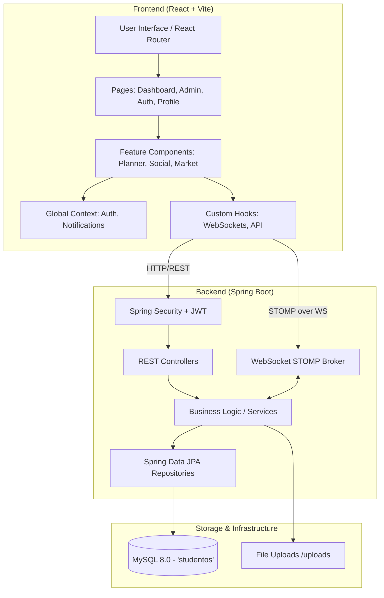

# StudentOS - Total Context Memory

This document serves as the **Total Context Memory** for the `StudentOS` project. It is designed to give you (the user) and AI agents a complete, high-level, and interconnected view of how the entire system operates, its architecture, and the detailed breakdown of its components.

## 🚀 Project Overview
**StudentOS** is a premium, all-in-one university management and productivity dashboard. It centralizes academic planning, campus resources, community commerce, and administrative oversight.

---

## 🏗️ High-Level Architecture

The project uses a decoupled Client-Server architecture.

---

## 🛠️ Technology Stack
### Frontend
*   **Framework**: React 18 (Vite)
*   **Styling**: Tailwind CSS (Dark-First, Glassmorphism UI)
*   **Animations**: Framer Motion
*   **Routing**: React Router 6
*   **State Management**: TanStack React Query (Server State) & Context API (Global State)
*   **Real-time**: SockJS + STOMP (WebSockets)

### Backend
*   **Framework**: Java 17 + Spring Boot 3.2.x
*   **Security**: Spring Security + JWT (Stateless sessions)
*   **ORM**: Spring Data JPA (Hibernate)
*   **Database**: MySQL 8.0
*   **Real-time**: Spring WebSocket STOMP
*   **Utilities**: Lombok, SLF4J

---

## 📂 Project Structure Map

### Frontend Components (`frontend/src/`)
The frontend is highly modularized by feature.

*   **Pages**: `LandingPage.jsx`, `Login.jsx`, `Register.jsx`, `Profile.jsx`, `AdminDashboard.jsx`, `About.jsx`, etc.
*   **Context**: Manages global state like User Session and WebSocket Notifications.
*   **Settings Components**
    - `SettingsPage.jsx` (Container)
      - `AccountSettings.jsx`
      - `NotificationSettings.jsx`
      - `SecuritySettings.jsx`
      - `PrivacySettings.jsx`

*   **Navigation Components**
    - `Sidebar.jsx`
    - `Header.jsx`
    - `NewEntryModal.jsx` (Contains logic to push items to dashboard)
      - `EntryFormFields.jsx` (Extracted shared form logic)

*   **Hooks**: 
    - `useProfileMutations.js` (Manages user settings)
    - `useSettingsMutations.js` (Manages system preferences and notification settings)
    - `useMarketplace.js` (Manages marketplace state)
    - `useStudyTasks.js` (Manages study planner state)
    - Extracted logic for API queries (e.g., `useUser`, `useAdminStats`) leveraging React Query for caching and optimistic updates.

*   **Components Directory Breakdown**:
    *   `ui/`: Reusable interface states (`LoadingState`, `ErrorState`, `EmptyState`).
    *   `planner/`: Study Planner Components
        - `StudyPlanner.jsx` (Container)
        - `WeeklyCalendarView.jsx` (Visual Calendar UI)
        - `FocusList.jsx` (Sidebar tasks list)
        - `TaskCard.jsx`, `PlannerModal.jsx`
    *   `profile/`: Profile Management
        - `EditProfileModal.jsx`
        - `forms/AcademicIdentityFields.jsx`
        - `forms/ContactInfoFields.jsx`
    *   `auth/`: 
        - `UsernameRecoveryForm.jsx`
        - `PasswordCodeRequestForm.jsx`
        - `PasswordResetForm.jsx`
    *   `resources/`:
        - `ResourceModal.jsx`
        - `ResourceFormFields.jsx`
    *   `marketplace/`, `reviews/`, `admin/`, etc.
    *   `dashboard/`: Main student dashboard widgets.
    *   `admin/`: Admin console components for managing users and resources.
    *   `planner/`: Study Planner and Task management.
    *   `resources/`: Academic resource sharing hub.
    *   `marketplace/`: Peer-to-peer campus trading.
    *   `lostfound/`: Lost & Found community board.
    *   `social/`: Messaging and collaboration components.
    *   `calculator/`: Tuition fee calculators.
    *   `events/`: Campus events and schedules.
    *   `reviews/`: Course and faculty reviews.
    *   `layout/` & `Navigation/`: App shell, sidebars, and top navigation.
    *   `Notifications/` & `NotificationToast/`: Real-time alert UI.

### Backend Components (`backend/src/main/java/com/studentos/backend/`)
The backend follows strict MVC layered architecture.

*   **Controllers** (API Endpoints):
    *   `AuthController` & `UserController`: Auth and profile management.
    *   `AdminController`: System administration tasks.
    *   `StudyPlannerController`: Tasks and schedules.
    *   `MarketplaceController` & `LostFoundController`: Commerce and community boards.
    *   `ResourceController`: File and note sharing.
    *   `MessageController` & `NotificationController`: Chat and system alerts.
    *   `TuitionFeeController`: Fee calculations.
    *   `CampusEventController` & `CampusServiceController`: University events and services.
    *   `CourseReviewController` & `ReviewRequestController`: Academic feedback.
*   **Services** (Business Logic):
    *   Extracted business logic and domain rules for all features (e.g., `AuthService`, `AdminService`, `StudyPlannerService`, `MarketplaceService`, `ResourceService`, `NotificationService`, `CampusEventService`, etc.).
    *   Ensures Controllers are lightweight and framework-agnostic where possible.
*   **Models** (JPA Entities mapping to MySQL tables):
    *   `User`, `StudyTask`, `MarketplaceItem`, `LostFoundItem`, `Resource`, `Message`, `Notification`, `TuitionFee`, `CampusEvent`, `CourseReview`, `Comment`, `TrafficRecord`, `Activity`, `CampusService`, `ReviewRequest`.

---

## 🗄️ Database Schema & Entity Relationships

---

## ⚡ Key Workflows & Features

> [!TIP]
> **Real-Time Engine (WebSockets)**
> StudentOS relies heavily on STOMP over WebSockets for live features. When a user sends a message or a system alert triggers, the Backend broadcasts to a STOMP topic (e.g., `/user/{id}/queue/notifications`). The Frontend hooks subscribe to these topics and instantly update the React Context, triggering Framer Motion toasts or chat updates.

> [!NOTE]
> **Authentication Flow**
> 1. User submits credentials to `AuthController`.
> 2. Backend validates the email and **strictly** checks the password using `passwordEncoder.matches()`. 
> 3. If valid, Backend generates:

### 6. Code Review & Performance Optimizations (Recent)
- **Backend Optimizations**:
  - `JVM & Container Footprint`: Added `-XX:TieredStopAtLevel=1` and `-XX:MaxRAMPercentage=75.0` to Dockerfile JRE Entrypoint to cut startup JVM boot time in half and optimize Heap usage within Render's free 512MB RAM constraints.
  - `Hikari Database Connection Pooling`: Configured Hikari database connection pool in `application.yml` with `minimum-idle: 2` (ensuring warm connection availability), `maximum-pool-size: 5` (respecting Aiven free plan limits), and `keepalive-time: 30000` (sending keep-alives to prevent Aiven from terminating idle connections).
  - `Lazy Loading Safety`: Fixed severe server crashes (`LazyInitializationException`) occurring during Jackson serialization of relationships on `Resource`, `MarketplaceItem`, `CourseReview`, and `ReviewRequest` endpoints. Replaced problematic `LAZY` fetch configurations globally with optimized `@EntityGraph` annotations in Spring Data Repositories for eager fetching on specific queries, preventing N+1 issues while ensuring serialization safety.
  - `AuthService`: Upgraded verification code generator to use `SecureRandom` (CWE-330 fix).
  - `EmailService & Infrastructure`: Removed `JavaMailSender` and SMTP due to Render Free Tier port blocking (ports 25, 465, 587). Completely rewrote the email delivery engine using Java 11 `HttpClient` to interface with the **Brevo HTTP API**, enabling reliable free email delivery without a custom domain.
  - `UserService` & `AdminService`: Resolved N+1 query bottlenecks during user deletion by leveraging bulk delete queries in `NotificationRepository` (`deleteByRelatedEntityIdIn`).
  - `AdminService`: Removed `parallelStream()` anti-pattern in `getTopContributors` to prevent JVM ForkJoin pool exhaustion, replacing it with a standard stream.
  - `Controllers`: Fixed Spring Boot 3.2 explicit parameter names issue globally by configuring `maven-compiler-plugin` and explicitly adding parameter names to `@PathVariable` and `@RequestParam` annotations.
  - `MessageRepository`: Implemented an optimized native SQL query with a self-join to efficiently fetch the latest message per conversation, powering the centralized Inbox.
  - `ResourceController`: Added `PUT /api/resources/{id}` allowing authors to edit resources securely.
  - `Transaction Management`: Added `@Transactional` to `CourseReviewService` and `ReviewRequestService` to prevent `LazyInitializationException` during cascading deletion of relational entities (comments).
  - `Security Overhaul`: Upgraded DELETE endpoints in `CourseReviewController` and `ReviewRequestController` to resolve the acting user via `@AuthenticationPrincipal` instead of an insecure URL query parameter, closing authorization vulnerabilities.
  - `Timezone Enforcement`: Hardcoded `ZoneId.of("Asia/Dhaka")` into `CampusServiceService` dynamic open/closed calculations to prevent UTC offset bugs from erroneously displaying Campus Services as "Open" during nighttime hours.
- **Database Architecture Updates**:
  - `MySQL Schema Adjustments`: Diagnosed and resolved fatal `Data truncation` errors on photo uploads by forcefully altering the schema for `marketplace_items` and `lost_found_items` to upgrade the `photos_json` column type from `TEXT` to `LONGTEXT`. Added `@Column(columnDefinition = "LONGTEXT")` mappings to JPA entities.
- **Frontend Optimizations**:
  - `Absolute Speed Architecture (Lazy Loading)`: Completely refactored `App.jsx` to utilize `React.lazy()` and `<Suspense>` boundaries for all routes and dashboard modules. This breaks the monolithic React bundle into dozens of micro-chunks, slashing Time to Interactive (TTI) and dropping the initial Javascript payload to ~35KB gzipped.
  - `Render-Blocking Optimizations`: Injected `loading="lazy"` and `decoding="async"` across key avatar renderings in `Navbar`, `Profile`, and `AccountSettings` to defer heavy image rendering and prioritize the First Contentful Paint (FCP).
  - `Vite Build & Safari WebKit Fixes`: Removed static manual chunking constraints in `vite.config.js` to enable deep tree-shaking of SVG libraries like `lucide-react` across individual page chunks. Additionally, successfully bypassed an iOS Safari thread-locking defect by dropping massive `blur-[120px]` CSS calculations on mobile viewports using `max-md:hidden`, ensuring instantaneous rendering on iPhones.
  - `Mobile Layout & Scroll Engine Refactor`: Resolved critical iOS Safari native scroll locks globally by relocating `overflow-x: clip` from the HTML `body` to `#root`, and eliminating hardcoded `overflow-y-auto` internal scroll containers across core modules (Campus Services, Reviews, Resources, Profile).
  - `Flexbox Overlap Resolutions`: Hardened mobile inputs and header structures by enforcing `min-w-0` on fluid text fields (TodoQuickList), locking buttons with `shrink-0 whitespace-nowrap`, and preventing backdrop-blur rendering clipping in the Navbar via absolute `inset-0` background layers.
  - `Optimistic Dashboard Updates`: Replaced blocking state loaders with frontend optimistic state updates for toggling, deleting, and quick task creations on `UserDashboard.jsx`. Enabled background silent updates (`refreshDashboard(true)`) to eliminate UI stutter and screen-blocking loaders during user actions.
  - `React Query`: Upgraded deprecated v4 query invalidation syntax (`queryClient.invalidateQueries([...])`) to v5 object syntax (`{ queryKey: [...] }`) in hooks like `useStudyTasks.js` to fix silent failures.
  - `Error Handling`: Hardened component renders (`StudyPlanner`, `StudentMarketplace`) against `Null Pointer Exceptions` and `TypeError` crashes by enforcing `Array.isArray()` fallbacks and optional chaining (`?.`) when parsing dynamic backend payloads, preventing white-screen fatal errors during empty states or backend anomalies.
- **UI & Design System Overhaul**:
  - `Study Planner UI Refinement`: Ensured task card action buttons (edit, complete, delete) are universally visible (especially on touch devices) by removing strict hover-based opacity gates from the `TaskCard` component within the Focus List.
  - `Design System`: Completely overhauled the UI to an Apple-style aesthetic using pure Tailwind CSS variables in `index.css` supporting dynamic Light/Dark mode via a new `ThemeContext`.
  - `Iconography`: Deprecated error-prone `material-symbols-outlined` in favor of reliable, vector-based `lucide-react` icons.
  - `Mobile Responsiveness`: Built a `MobileNav.jsx` bottom-tab bar for mobile layouts. Embedded a persistent `GlobalSearch` into the mobile `Navbar`. Adjusted dynamic padding (`pt-[124px]`, `max-md:pb-32`) globally to prevent content from being obscured by top and bottom navigation bars on small screens.
  - `Mobile Layout & Scroll Fixes`: Disabled nested internal scrolling (`h-full`, `overflow-y-auto`) exclusively on mobile for complex pages (`StudyPlanner`, `StudentMarketplace`, `EventsAnnouncements`) to enable smooth, native browser scrolling. Fixed a critical "horizontal squish" layout bug by injecting `min-w-0` into the root `DashboardLayout` flex container. Also fixed an iOS scrolling lock bug by changing the `<main>` container's `overflow-x-hidden` to `overflow-x-clip`, restoring vertical touch scrolling on mobile browsers.
  - `Study Planner Fix`: Rewrote and fixed rendering bugs in the planner modules (`StudyPlanner`, `FocusList`, `WeeklyCalendarView`, `PlannerModal`, `TaskCard`) matching the new responsive design.
  - `Card Footer Densification`: Replaced the "Message" button text with an icon-only approach inside `ResourceCard` footers to save horizontal space and prevent extreme truncation of author names.
  - `Component Polish`: Fixed an unclickable "Close" button in the `PublicProfile` modal by applying `pointer-events-none` to the decorative background glow, and bumped up contrast for "Closed" status badges on `CampusServicesDirectory` cards.
- **New Features (Recent)**:
  - `Public SEO Architecture`: Created SEO-optimized public landing pages (`/features/calculator`, `/features/marketplace`, etc.) for internal modules to allow Google indexing without bypassing authentication. App routing was updated, and a `sitemap.xml` was created for search crawlers.
  - `Registration Email Verification`: Built a complete email verification flow. Backend now includes a `resend-verification` endpoint. Frontend has a new `VerifyEmail.jsx` screen with an auto-advancing 6-digit OTP input that supports copy/paste. The authentication routing securely blocks unverified logins and directs users to the verification screen.
  - `Centralized Inbox`: Built `Inbox.jsx` providing a full-screen, two-pane layout for all Direct Messages, fully integrated with real-time WebSockets and reachable via the main sidebar.
  - `Resource Interaction`: Added inline "Edit" controls for resource authors and a "Message" button on `ResourceCard` enabling direct user-to-author communication.
  - `Admin Course Reviews`: Added full management of `CourseReview` entities into the Admin Dashboard, introducing `TabReviews.jsx` and new robust backend administrative endpoints for review monitoring and secure deletion.
  - `Review Requests`: Expanded the `ReviewRequest` entity and forms to support `courseName` (Course Title), allowing students to request reviews for specific course titles, and seamlessly pre-filling this data when fulfilling a request.
  - `Marketplace Branding`: Converted marketplace pricing indicators globally from Dollars ($) to the Bangladeshi Taka (৳) symbol.
  - `Lost & Found UX`: Overhauled the "Mark as Resolved" action on `LostFoundItemCard` with a smooth loading state and dynamic text transitions during API calls.
- **DevOps & Scripting**:
  - `Run Script Architecture`: Rebuilt `run-all.bat` with a robust, interactive TUI (Text User Interface) for managing the Node and Java development servers, integrating strict taskkill procedures and resolving CRLF batch script parsing faults.

### 7. Remaining Tech Debt / Next Steps
- Implement HttpOnly cookies for JWT (currently in localStorage).
> 4. Frontend stores token (usually in local storage/context) and attaches it to the `Authorization: Bearer <token>` header for all subsequent API calls.
> 5. Spring Security's `JwtFilter` intercepts requests and sets the security context.

> [!CAUTION]
> **Security Critical:** The password validation step (`passwordEncoder.matches()`) must NEVER be bypassed. A previous vulnerability where this check was commented out has been fixed.

> [!TIP]
> **Testing Strategy**
> Since the backend strictly adheres to a `Controller -> Service -> Repository` architecture, Unit Tests for Controllers (e.g., `AuthControllerTest`, `ResourceControllerTest`) should **mock the Service layer**, not the Repository layer. Tests must accurately reflect the specific methods used by the controllers (e.g., `findByEmailIgnoreCase` vs `findByEmail`).

> [!IMPORTANT]
> **Admin Capabilities**
> The `AdminController` has elevated privileges verified by Spring Security roles. Admins can monitor system traffic (`TrafficRecord`), manage user accounts, moderate marketplace/lost-found items, and update global `CampusEvent` and `CampusService` data.

## 🔗 How Everything Connects

1.  **Frontend -> Backend**: The React app in `frontend` makes asynchronous HTTP requests using `fetch` or `axios` to the Spring Boot REST API running on port `8081`. 
2.  **State Management**: React Context (`context/`) holds the User Profile and Auth state so components like the Dashboard and Navigation know who is logged in and what to render.
3.  **Data Flow**: For a feature like **Study Planner**:
    *   UI: User adds a task in `planner` components.
    *   Request: POST to `/api/study-tasks` with JWT.
    *   Backend: `StudyPlannerController` -> `StudyPlannerService` -> `StudyTaskRepository`.
    *   Database: Saved to `study_tasks` table.
    *   Response: Returns saved entity, Frontend state updates, triggering a re-render.
4.  **Launch Mechanism**: The `run-all.bat` script is a utility that simultaneously spins up the Vite development server and the Maven Spring Boot application.

---

## 🚀 Production Deployment Architecture

The StudentOS platform is fully containerized and deployed using modern free-tier PaaS and DBaaS providers.

- **Frontend (Vercel)**: Deployed as a static React/Vite site. Automatically rebuilt on pushes to GitHub. The frontend environment is securely linked to the backend via `VITE_API_URL` and `VITE_WS_URL`.
- **Backend API (Render)**: Deployed as a Docker Web Service. The application runs Spring Boot 3 inside an `eclipse-temurin:17-jre-alpine` container.
- **Database (Aiven)**: Uses a managed MySQL 8.0 instance. The Spring Boot backend dynamically maps the database connection using standard JDBC environment variables (`DB_URL`, `DB_USER`, `DB_PASSWORD`).
- **Keep-Alive (UptimeRobot)**: To bypass Render's 15-minute sleep threshold (which causes 50-second cold starts), a lightweight `/api/ping` endpoint inside `PingController` is pinged every 14 minutes by UptimeRobot, keeping the JVM warm and responsive.
- **Security / CORS**: The backend is tightly bound to the Vercel frontend domain via the `CORS_ORIGINS` environment variable mapped in `application.yml`, preventing unauthorized origin access while allowing credentials.

---

## 🔍 UIU Localized SEO Architecture

To ensure the platform is discoverable on Google by United International University students, the React SPA implements a targeted SEO strategy:

- **Public Feature Pages (`/features/*`)**: Core tools (Calculator, Marketplace, Reviews, Resources) are shielded behind authentication. To allow Google to index these tools, lightweight public landing pages exist outside the `<ProtectedRoute>`. These pages contain SEO content, Schema markup, and prompt the user to log in to access the actual tool.
- **Dynamic Meta Tags (`react-helmet-async`)**: The `<SEO>` component dynamically updates the `<title>`, `<meta name="description">`, OpenGraph data (for social sharing previews on Facebook/Discord/WhatsApp), and Twitter Card data based on the route.
- **JSON-LD Schema**: The application utilizes `SoftwareApplication` and `CollectionPage` structured data referencing `United International University` as the provider to dominate local search queries.
- **Sitemap**: A static `sitemap.xml` is maintained in the `public` directory, ensuring search engine crawlers can index the public landing pages effectively.
