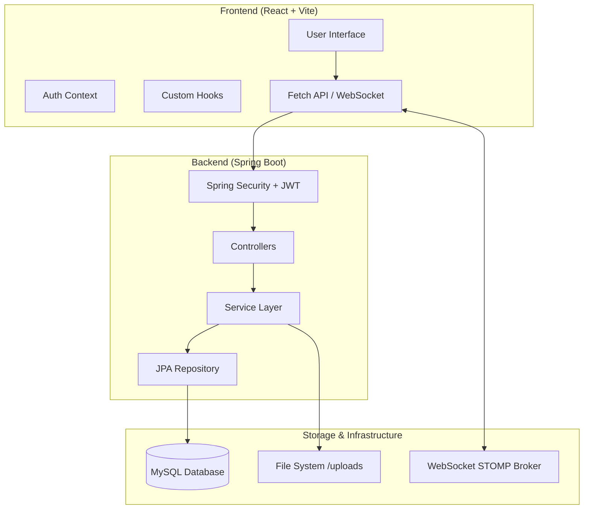

# StudentOS - Unified System Guide 🎓

This document provides a comprehensive overview of the **StudentOS** architecture, database design, component interactions, and instructions for manual system verification.

---

## 1. High-Level Architecture

StudentOS follows a decoupled **Client-Server Architecture** designed for high performance and scalability.



### Core Technologies
- **Frontend**: React 18, Vite, Tailwind CSS, Framer Motion.
- **Backend**: Java 17, Spring Boot 3.2.x, Spring Security (JWT), Spring Data JPA.
- **Database**: MySQL 8.0.
- **Communication**: REST APIs (HTTP) & Real-time WebSockets (STOMP).

---

## 2. Project Structure

### Backend (`/backend`)
Located in `src/main/java/com/studentos/backend/`:
- **config/**: System configurations (JWT Security, CORS, WebMvc, WebSockets).
- **controller/**: REST API Endpoints that handle incoming JSON requests.
- **service/**: Core business logic and service orchestration.
- **repository/**: Data access layer using Spring Data JPA.
- **model/**: JPA Entities representing the relational database schema.
- **dto/**: Data Transfer Objects for secure and optimized API responses.

### Frontend (`/frontend`)
Located in `src/`:
- **pages/**: Main application views (Dashboard, Admin Console, Login).
- **components/**: Modular UI elements (Marketplace, Planner, Social, etc.).
- **context/**: Global state management (Authentication, Notifications).
- **hooks/**: Encapsulated logic for API fetching and WebSocket subscriptions.

---

## 3. Database Design & Integration

### Configuration
The database connection is defined in `backend/src/main/resources/application.yml`:
```yaml
spring:
  datasource:
    url: jdbc:mysql://localhost:3306/studentos?createDatabaseIfNotExist=true
    username: root
    password: [YOUR_PASSWORD]
  jpa:
    hibernate:
      ddl-auto: update
```

### Core Entities & Table Mapping
The schema is highly relational, centering around the `User` entity.

| Entity | Table | Description |
| :--- | :--- | :--- |
| `User` | `users` | Primary entity for auth and profiles (STUDENT/ADMIN). |
| `CourseReview` | `course_reviews` | Student feedback on courses and faculty. |
| `Comment` | `comments` | Threaded discussions attached to reviews. |
| `MarketplaceItem` | `marketplace_items` | Campus-wide trading items. |
| `CampusEvent` | `campus_events` | University schedules and announcements. |
| `StudyTask` | `study_tasks` | Personal task management for students. |
| `Resource` | `resources` | Shared academic materials and notes. |

---

## 4. Component Connections 🔌

### API & JWT Security
1. **Request**: Frontend sends an HTTP request (GET/POST/etc.) to `VITE_API_URL`.
2. **Auth**: The `JwtFilter` intercepts the request, extracting the token from the `Authorization` header.
3. **Validation**: Spring Security validates the token. If valid, the request proceeds to the Controller.

### Real-Time Communication
- **Protocol**: STOMP over WebSockets via SockJS.
- **Usage**: Used for instant chat messages and system-wide notifications.
- **Endpoint**: `ws://localhost:8081/ws-studentos`.

---

## 5. Manual Verification Guide 🔍

### A. Checking the Backend
- **Logs**: Monitor the terminal where you ran `.\mvnw spring-boot:run`. Look for `Started BackendApplication` and any SQL/Hibernate traces.
- **Endpoints**: Use `curl` or a browser to visit `http://localhost:8081/api/health` (if available) or check the API documentation.

### B. Checking the Frontend
- **Developer Tools**: Press `F12` and check the **Network** tab. Ensure requests to the backend are not blocked by CORS and return `200` or `201` status codes.
- **State**: Check **Local Storage** for `studentos_user` to verify session persistence.

### C. Checking the Database
Access your MySQL instance directly to verify data integrity:
```sql
USE studentos;
SHOW TABLES;
SELECT * FROM users WHERE role = 'ADMIN';
```

### D. API Testing
Use **Postman** or **Insomnia** to test routes independently:
- **Base URL**: `http://localhost:8081`
- **Protected Routes**: Include the header `Authorization: Bearer <YOUR_TOKEN>`.
